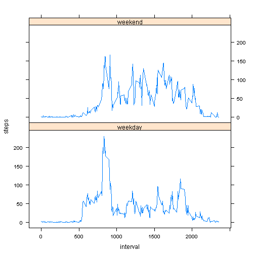

##Introduction

It is now possible to collect a large amount of data about personal movement using activity monitoring devices such as a Fitbit, Nike Fuelband, or Jawbone Up. These type of devices are part of the "quantified self" movement - a group of enthusiasts who take measurements about themselves regularly to improve their health, to find patterns in their behavior, or because they are tech geeks. But these data remain under-utilized both because the raw data are hard to obtain and there is a lack of statistical methods and software for processing and interpreting the data.

This report makes use of data from a personal activity monitoring device. This device collects data at 5 minute intervals through out the day. The data consists of two months of data from an anonymous individual collected during the months of October and November, 2012 and include the number of steps taken in 5 minute intervals each day.

##The data

The variables included in the dataset are:

1. steps: Number of steps taking in a 5-minute interval (missing values are coded as NA)

2. date: The date on which the measurement was taken in YYYY-MM-DD format

3. interval: Identifier for the 5-minute interval in which measurement was taken

The dataset is stored in a comma-separated-value (CSV) file and there are a total of 17,568 observations in this dataset. It is obtained as:


```r
data <-read.csv("./activity.csv")
```

##The study

The study consist on the graphical or numerical answer to 4 questions or topics, covered in the following sections.

### 1. What is mean total number of steps taken per day?

Using the command aggregate it is possible to obtain a sub data frame (p1) containing the data frame with
the sum of the steps per day.


```r
p1 <- aggregate(data[,1], by = list(data$date), FUN = sum, na.action = NULL)
```

And taking the mean and median of the corresponding column for the steps per day, the question is answered:


```r
mean(p1$x, na.rm = TRUE)
```

```
## [1] 10766
```

```r
median(p1$x, na.rm = TRUE)
```

```
## [1] 10765
```

###2. What is the average daily activity pattern?

The first of the following commands create a similar data table of the previous question, but averaging the number of steps taken across all days, and the second command plots a temporal serie of the average number of steps over the day.


```r
p2 <- aggregate(data[,1], by = list(data$interval), FUN = mean, na.rm=TRUE, na.action=NULL)
plot(p2$Group.1, p2$x, type = "l", xlab="5 minute interval",ylab="Number of steps")
```

 

### Which 5-minute interval, on average across all the days in the dataset, contains the maximum number of steps?

```r
p2[p2$x == max(p2$x), 1]
```

```
## [1] 835
```

The interval of 8h35 min, so from 8:35 to 8:40.

###3. Imputing missing values

####Calculate and report the total number of missing values in the dataset 

The number of NA in the dataset is computed as:


```r
nas<- sum(is.na(data$steps))
nas
```

```
## [1] 2304
```

####Devise a strategy for filling in all of the missing values in the dataset.

The strategy more reasonable is to change the NA for the average of the interval, as the data owned contains more diversity of 5minute periode than days.

####Create a new dataset (data2) that is equal to the original dataset but with the missing data filled in

A possible solution of the problem is to create a vector with the index of all the NA's of the dataset, and loop over the length of it to change their values for the value of the average of the same step (calculated with p2).


```r
data2<-data
idxna <- which(is.na(data$steps))
for (i in 1: nas) {
        data2$steps[idxna[i]] = p2$x[p2$Group.1 == data2$interval[idxna[i]]]
}
```


####Make a histogram of the total number of steps taken each day and Calculate and report the mean and median of the total number of steps taken per day. 

A similar step as before is done, and the histogram plot.


```r
p3 <- aggregate(data2[,1], by = list(data2$date), FUN = sum, na.rm=TRUE, na.action=NULL)
hist(p3$x, breaks = 30)
```

 

And the mean and the median calculated are:


```r
mean(p3$x)
```

```
## [1] 10766
```

```r
median(p3$x)
```

```
## [1] 10766
```

#### Do these values differ from the estimates from the first part of the assignment? What is the impact of imputing missing data on the estimates of the total daily number of steps?

The mean cannot differ. The median, however, DO differed from the other. As the median and mean were very closed, the change in the median is small, but there is a change. The impact of that fact is clearly a change on the median.

###4. Are there differences in activity patterns between weekdays and weekends?

Create a new factor variable in the dataset with two levels - "weekday" and "weekend".
(note that my Rstudio is in Spanish, so saturday in my case is "sábado" and sunday "domingo")


```r
aux <- weekdays(as.Date(data2$date))
for (i in 1:length(aux)) {
        if (aux[i] == "sábado" | aux[i] =="domingo") aux[i] <-"weekend"
        else aux[i]<-"weekday"
}

data2$day <- aux
```

Make a panel plot containing a time series plot of the 5-minute interval and the average number 
of steps taken, averaged across all weekday days or weekend days. 


```r
library(lattice)

p4 <- aggregate(data2[,1], by = c(interval = list(data2$interval), day = list(data2$day)), FUN = mean, na.rm=TRUE, na.action=NULL)
names(p4)[3] = "steps"
xyplot(steps ~ interval | day, data = p4, layout = c(1, 2), type = "l" )
```

 
